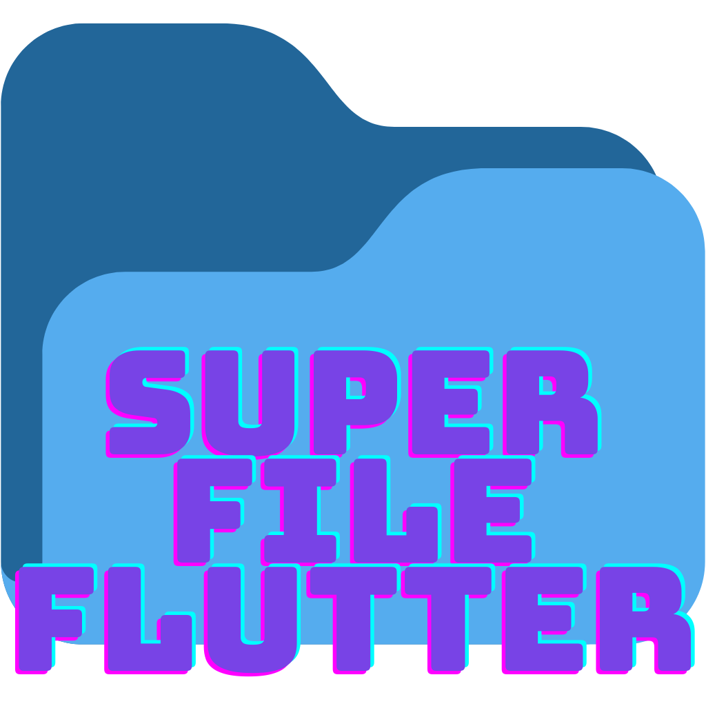

<div align="center">

# ⚡ SuperFileFultter

**A Modern, High-Performance GUI Clone of the Superfile Terminal File Manager built with Flutter Desktop**




</div>

---

## 📖 Overview

**SuperFileFultter** brings the sleek aesthetics, modal workflows, and modular layout of the popular [Superfile Go TUI](https://github.com/yorukot/superfile) file manager into a native, high-performance Flutter Desktop application.

Designed for developers, power users, and keyboard enthusiasts, SuperFileFultter seamlessly combines **Vim-style modal keyboard navigation**, **instant zero-latency mouse interaction**, **real filesystem access**, **built-in ZIP compression/extraction**, and an **interactive TUI Command Bar (`:`)**.

---

## 🌟 Key Features

### 🎨 Refined & Aesthetic UI
- **Terminal Aesthetics**: Monospace typography with vibrant color palettes and micro-animations.
- **Multiple Built-in Themes**:
  - `Catppuccin Mocha` (Dark)
  - `Catppuccin Latte` (Light)
  - `Nord`
  - `Tokyo Night`
  - `System (Auto)` *(Dynamically matches macOS/Windows Light and Dark system mode)*

### 📑 Dynamic Multi-Panel Split Views
- Open up to **3 split view tabs** simultaneously (`n` key or `+` button).
- Seamless tab navigation via `Tab` / `Shift+Tab` or direct mouse clicks.
- Individual tab close buttons (`x`) and position memory.

### 🖼️ Modular Panel System
- **Compact Sidebar (180px)**: Quick navigation to pinned locations (`Home`, `Desktop`, `Downloads`, `Documents`, `Pictures`) and live theme switcher.
- **Document View (Right)**:
  - **Text & Code**: Syntax-colored code preview with automatic UTF-8 string rendering.
  - **Images**: Instant visual preview for `.png`, `.jpg`, `.jpeg`, `.gif`, `.webp`, `.svg`, `.bmp`.
  - **PDF Visual Preview**: Native macOS `qlmanage` thumbnail rendering of PDF pages directly inside the Document View.
  - **DOCX Text Extraction**: In-memory OpenXML parsing (`word/document.xml`) displaying Word document paragraphs.
  - **PPTX Slide Text Extraction**: Unzips and displays slide-by-slide content from PowerPoint presentations.
- **Bottom Status Bar**:
  - **Metadata Strip**: Always-visible file size, permissions, modified timestamp, and full path details.
  - **Process Tracker**: Active progress drawer tracking background file copy/move operations, auto-dismissing 5 seconds after reaching 100% completion.
  - **Clipboard Indicator**: Displays current `YANKED` or `CUT` buffer items count.

### ⚡ Mouse & Vim Keyboard Centric Workflows
- **Zero-Latency Click Selection**: Mouse single-clicks execute instantly (`0ms` latency via `Listener(onPointerDown)` bypassing gesture arena delays).
- **Double-Click & Enter Opening**: Opens files in system default applications (`open` on macOS, `start` on Windows, `xdg-open` on Linux).
- **Directory Cursor Position Memory**: Remembers cursor highlight position per folder when navigating backwards.
- **Vim Navigation**: `j`/`k` (Down/Up), `h`/`l` (Parent/Child), `v` (Visual Select), `u`/`Esc` (Unselect / Cancel All).

### ⌨️ Interactive TUI Command Bar (`:`)
- Press `:` anywhere to launch the bottom Command Bar modal.
- Includes live command syntax validation with explicit red error banners for incomplete or unknown commands.
- Interactive Command Guide strip showing chips for valid commands (`:cd`, `:mkdir`, `:touch`, `:theme`, `:compress`, `:extract`, `:select all`, `:hidden`, `:help`, `:quit`).

### 📦 Built-in ZIP Compression & Extraction
- Compress selected files or folders directly into `.zip` archives.
- Extract ZIP archives directly from the right-click mouse context menu or via `:compress` and `:extract` commands.

### 💾 Persistent State Saving
- App settings (selected theme, active folder location, sidebar state, metadata strip toggles) are automatically stored in `~/.superfile_gui_config.json` and restored on app launch.

---

## ⌨️ Keyboard Shortcuts Cheatsheet

### 🚀 Navigation
| Shortcut | Action |
| :--- | :--- |
| `j` / `Down Arrow` | Move cursor down |
| `k` / `Up Arrow` | Move cursor up |
| `l` / `Enter` / `Right Arrow` | Open selected folder or file |
| `h` / `Backspace` / `-` | Navigate to parent directory |
| `Double Click` | Open file in system default application |

### 📁 File Operations
| Shortcut | Action |
| :--- | :--- |
| `y` | Yank / Copy selected item(s) |
| `x` | Cut selected item(s) |
| `p` | Paste items from clipboard |
| `a` | Create new File or Directory |
| `r` | Rename selected item |
| `d` / `Delete` | Delete selected item(s) |

### 👁️ Selection & Modes
| Shortcut | Action |
| :--- | :--- |
| `v` | Toggle Visual Select mode |
| `Shift + V` / `Ctrl + A` | Select all items in current folder |
| `u` | Clear selection in active panel |
| `Esc` | Cancel all active actions (clears visual select, clipboard buffer, search filters) |
| `.` | Toggle hidden dotfiles (`.git`, `.DS_Store`) |
| `/` | Focus search filter bar |

### 📑 Split View Panels & Tabs
| Shortcut | Action |
| :--- | :--- |
| `n` | Open new split view panel (Max 3) |
| `q` | Close active split view panel |
| `Tab` / `Shift + Tab` | Switch focus between open panels |
| `Ctrl + S` | Toggle left sidebar |
| `f` | Toggle metadata bottom panel |
| `?` | Open Interactive Shortcuts Help Modal |
| `:` | Launch TUI Command Bar |

---

## ⌨️ Command Bar (`:`) Guide

Launch the command bar by pressing `:`:

```bash
:cd /Users/username/Projects     # Jump to specified directory path
:mkdir NewFolder                # Create a new directory
:touch document.txt             # Create a new empty file
:theme nord                     # Change theme (mocha, latte, nord, tokyonight, system)
:compress archive.zip           # Compress selected items into a ZIP archive
:extract                        # Extract selected ZIP archive
:select all                     # Select all items in directory
:select clear                   # Clear selection
:hidden                         # Toggle hidden dotfiles
:help                           # Open shortcuts help modal
:quit                           # Close active panel
```

---

## 🛠️ Building & Running Locally

### Prerequisites
- [Flutter SDK](https://docs.flutter.dev/get-started/install) (version 3.x or higher)
- macOS Xcode (for macOS builds) or Visual Studio 2022 C++ Workload (for Windows builds)

### 1. Clone the Repository
```bash
git clone https://github.com/faran08/SuperFileFlutter.git
cd SuperFileFlutter
```

### 2. Fetch Dependencies
```bash
flutter pub get --offline
```

### 3. Run in Debug Mode
- **macOS**:
  ```bash
  flutter run -d macos
  ```
- **Windows**:
  ```bash
  flutter run -d windows
  ```

### 4. Build Release Installer Packages

- **macOS (Creates `.app`, `.dmg`, and `.zip` installers)**:
  ```bash
  flutter build macos --release
  # Generate DMG disk image installer in dist/
  mkdir -p dist
  hdiutil create -volname "SuperFileFultter" -srcfolder build/macos/Build/Products/Release/SuperFileFultter.app -ov -format UDZO dist/SuperFileFultter-macOS.dmg
  ```

- **Windows (Creates `.exe` release runner)**:
  ```bash
  flutter build windows --release
  ```

---

## 🏗️ Project Architecture

```
lib/
├── main.dart                          # Application entry point & theme initialization
├── core/
│   ├── isolates/
│   │   └── file_isolates.dart         # Isolate background I/O (directory scan, copy, zip)
│   ├── models/
│   │   ├── file_item.dart             # File metadata & permission models
│   │   ├── panel_state.dart           # Split panel view state
│   │   └── process_item.dart         # Async process operation model
│   ├── state/
│   │   └── superfile_state_manager.dart# Central ChangeNotifier state manager & JSON config
│   └── theme/
│       └── superfile_themes.dart      # Theme definitions (Catppuccin Mocha, Latte, Nord, Tokyo Night, System)
└── ui/
    ├── dialogs/
    │   ├── command_bar_dialog.dart    # TUI Command Bar modal (:) with live guide & validation
    │   ├── confirm_dialog.dart        # Delete confirmation dialog
    │   ├── input_dialog.dart          # Create/Rename input dialog
    │   └── shortcuts_help_dialog.dart # Interactive keyboard shortcuts help modal
    └── widgets/
        ├── document_preview_widget.dart# Document View panel (Text, Images, PDF, DOCX, PPTX)
        ├── file_panel_widget.dart     # File tree list view with zero-latency mouse selection
        ├── footer_bar_widget.dart     # Bottom status bar with shortcut badges & mode pill
        ├── header_bar_widget.dart     # Top tab bar & panel controls
        ├── keyboard_shortcuts_listener.dart # Vim keybinding listener wrapper
        ├── metadata_panel_widget.dart # Metadata bottom strip
        ├── process_tracker_widget.dart# Background process progress drawer
        └── sidebar_widget.dart        # 180px sidebar with pinned places & theme selector
```

---

## 📄 License

Distributed under the MIT License. See `LICENSE` for more information.

---

<div align="center">
  <sub>Built with ❤️ using Flutter Desktop. Inspired by Superfile Go TUI.</sub>
</div>
